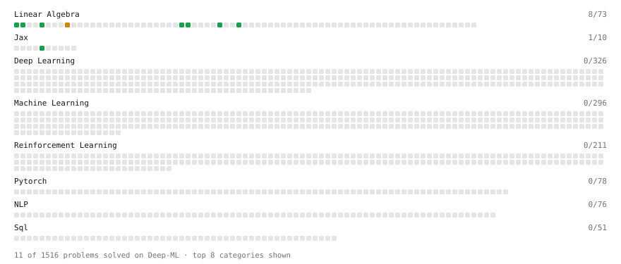

# Deep-ML

My machine learning practice from [Deep-ML](https://www.deep-ml.com). Every solution here was written by hand.

**20** solved · 18 problems · 0 labs · 2 math

[**Browse the interactive portfolio**](https://farazeid.github.io/deep-ml/) to replay this filling in over time.

## Problems

| | Difficulty | Solved | |
| --- | --- | --- | --- |
| [Calculate Cosine Similarity Between Vectors](https://www.deep-ml.com/problems/76) | easy | 2026-10-02 | [solution](problems/0076-calculate-cosine-similarity-between-vectors) |
| [Compiling Functions with jax.jit](https://www.deep-ml.com/problems/1327) | easy | 2026-10-02 | [solution](problems/1327-compiling-functions-with-jax-jit) |
| [Derivative of a Polynomial](https://www.deep-ml.com/problems/116) | easy | 2026-10-02 | [solution](problems/0116-derivative-of-a-polynomial) |
| [Dot Product Calculator](https://www.deep-ml.com/problems/83) | easy | 2026-10-02 | [solution](problems/0083-dot-product-calculator) |
| [Immutable Arrays: Functional Updates with .at](https://www.deep-ml.com/problems/1324) | easy | 2026-10-02 | [solution](problems/1324-immutable-arrays-functional-updates-with-at) |
| [Matrix-Vector Dot Product](https://www.deep-ml.com/problems/1) | easy | 2026-10-02 | [solution](problems/0001-matrix-vector-dot-product) |
| [ReLU with JAX Arrays](https://www.deep-ml.com/problems/1323) | easy | 2026-10-02 | [solution](problems/1323-relu-with-jax-arrays) |
| [Scalar Multiplication of a Matrix](https://www.deep-ml.com/problems/5) | easy | 2026-10-02 | [solution](problems/0005-scalar-multiplication-of-a-matrix) |
| [Transpose of a Matrix](https://www.deep-ml.com/problems/2) | easy | 2026-10-02 | [solution](problems/0002-transpose-of-a-matrix) |
| [Vector Element-wise Sum](https://www.deep-ml.com/problems/121) | easy | 2026-10-02 | [solution](problems/0121-vector-element-wise-sum) |
| [Vector Norms (L1/L2/L-inf) and the Frobenius Norm](https://www.deep-ml.com/problems/328) | easy | 2026-10-02 | [solution](problems/0328-vector-norms-l1-l2-l-inf-and-the-frobenius-norm) |
| [Your First Gradient with jax.grad](https://www.deep-ml.com/problems/1325) | easy | 2026-10-03 | [solution](problems/1325-your-first-gradient-with-jax-grad) |
| [Matrix times Matrix ](https://www.deep-ml.com/problems/9) | medium | 2026-10-02 | [solution](problems/0009-matrix-times-matrix) |
| [Multi-Parameter Gradients with argnums](https://www.deep-ml.com/problems/1326) | medium | 2026-10-03 | [solution](problems/1326-multi-parameter-gradients-with-argnums) |
| [PyTrees: One SGD Step with tree_map](https://www.deep-ml.com/problems/1330) | medium | 2026-10-03 | [solution](problems/1330-pytrees-one-sgd-step-with-tree-map) |
| [Quotient Rule for Derivatives](https://www.deep-ml.com/problems/312) | medium | 2026-10-02 | [solution](problems/0312-quotient-rule-for-derivatives) |
| [Random Numbers the JAX Way: PRNG Keys](https://www.deep-ml.com/problems/1329) | medium | 2026-10-03 | [solution](problems/1329-random-numbers-the-jax-way-prng-keys) |
| [Vectorizing with jax.vmap](https://www.deep-ml.com/problems/1328) | medium | 2026-10-03 | [solution](problems/1328-vectorizing-with-jax-vmap) |

## Math

| | Difficulty | Solved | |
| --- | --- | --- | --- |
| [Derivatives and Gradients](https://www.deep-ml.com/math-problems/1) | easy | 2026-10-02 | [solution](math/0001-derivatives-and-gradients) |
| [Gradient Descent Updates](https://www.deep-ml.com/math-problems/5) | easy | 2026-10-02 | [solution](math/0005-gradient-descent-updates) |

---

_This file is regenerated by Deep-ML on every push._
